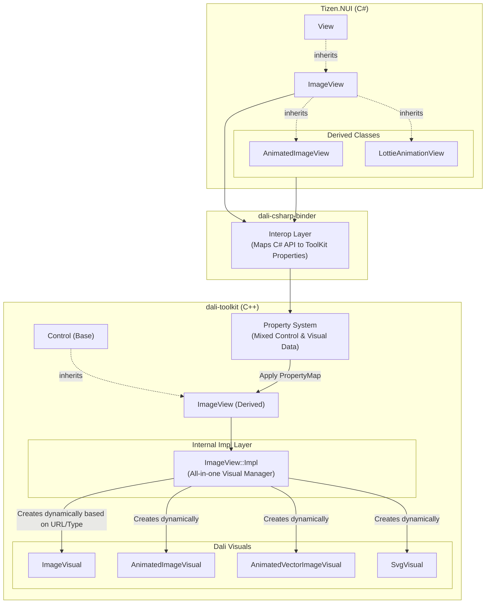
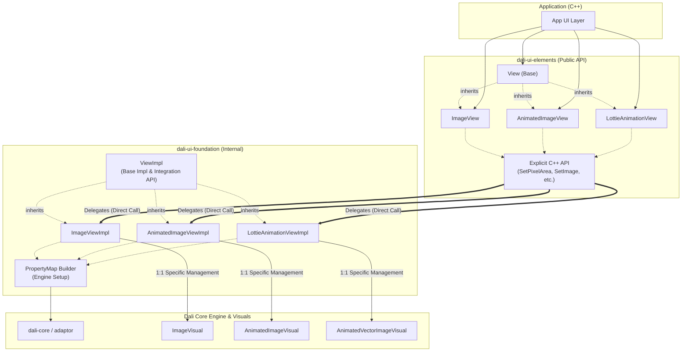

# ImageView Structure

## 1. Before (dali-toolkit Architecture)

기존 `dali-toolkit` 구조에서는 베이스가 되는 `ImageView` 클래스가 `ImageVisual`, `AnimatedImageVisual`, `SvgVisual` 등 다양한 Visual들을 Property Map 값(`URL`이나 `TYPE`)에 따라 내부에서 동적으로 생성하고 범용적으로 처리하는 무거운 역할을 담당했습니다.

---

## 2. After (dali-ui Architecture Plan)

새로운 `dali-ui` 구조에서는 애플리케이션 개발자가 C++ 단에서 명시적으로 사용하는 뷰(`ImageView`, `AnimatedImageView` 등)들이 1:1로 매칭되는 `Visual` 타입만을 전문적으로 취급하도록 `Impl` 클래스들이 확실하게 역할을 분담합니다.

