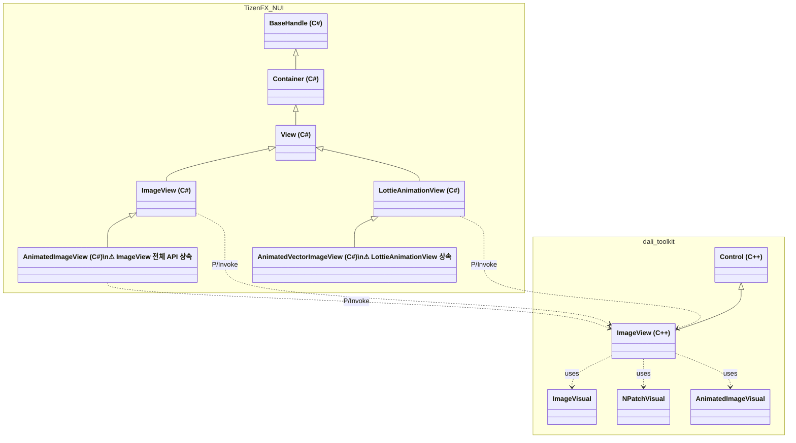
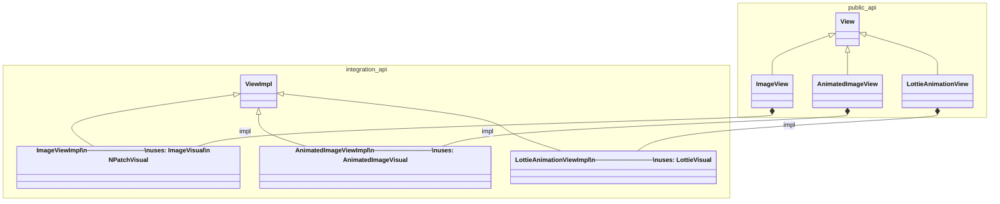
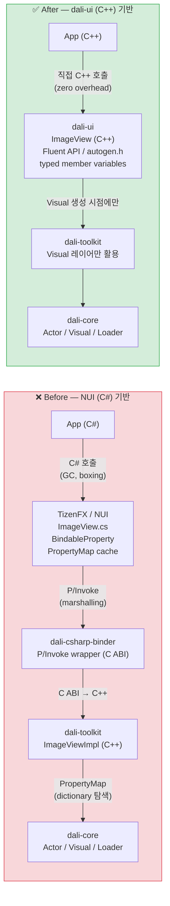
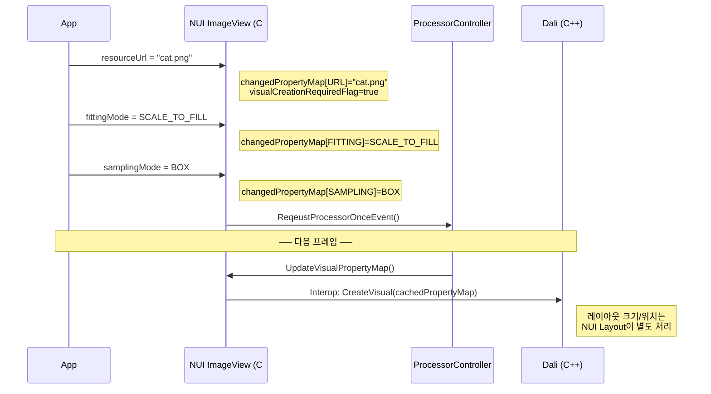
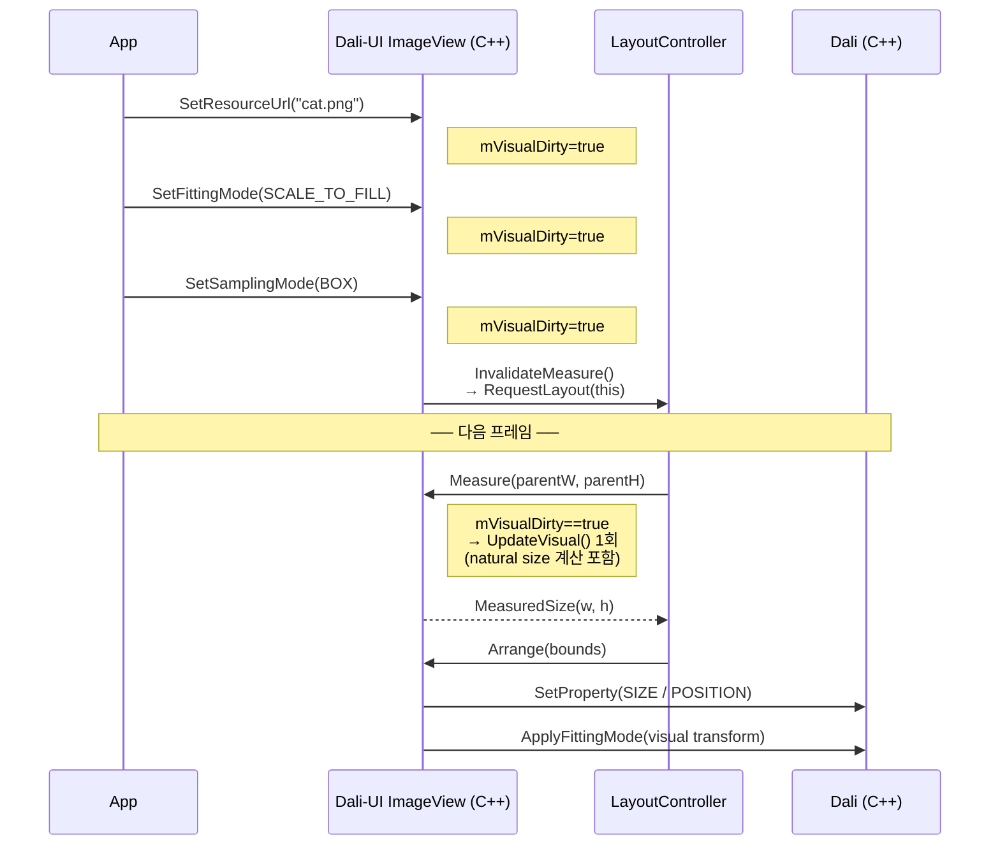

# ImageView Architecture: NUI → dali-ui Migration

## 1. Class Hierarchy

### Before — NUI + dali-toolkit

---

### After — dali-ui-foundation

| | NUI + dali-toolkit | dali-ui-foundation |
|--|--------------------|--------------------|
| `AnimatedImageView` 부모 | `ImageView` (불필요한 API 전체 노출) | `View` (필요한 API만) |
| `AnimatedVectorImageView` 부모 | `LottieAnimationView` (중첩 상속) | `View` (독립) |
| Visual 사용 | toolkit ImageView 하나가 모든 Visual 담당 | 각 Impl이 전담 Visual만 사용 |
| 언어 경계 | C# / C / C++ (3개 언어) | C++ 단일 |

---

## 2. Before / After Architecture

| | NUI | dali-ui |
|--|-----|---------|
| 호출 레이어 | 5단계 (App → NUI → Binder → Toolkit → Core) | 3단계 (App → dali-ui → Core) |
| Property 설정 | BindableProperty → P/Invoke → PropertyMap 딕셔너리 | 직접 typed 멤버 변수 할당 |
| 타입 안전성 | 런타임 (object boxing/unboxing) | 컴파일타임 |
| Fluent API | ❌ | ✅ `.SetFittingMode().SetSamplingMode().SetResourceUrl()` |
| C# 런타임 의존 | ✅ (필수) | ❌ (불필요) |

---

## 3. NUI → dali-ui 기능 대응표

### ImageView

| NUI API | dali-ui API | 상태 |
|---------|------------|------|
| `ResourceUrl` | `SetResourceUrl()` / `Reload()` | ✅ |
| `Image` (PropertyMap) | 개별 Set 메서드로 분리 | ✅ 타입 안전하게 개선 |
| `FittingMode` | `SetFittingMode()` | ✅ |
| `SamplingMode` | `SetSamplingMode()` | ✅ |
| `DesiredWidth/Height` | `SetDesiredSize()` | ✅ |
| `PixelArea` | `SetPixelArea()` | ✅ |
| `PlaceHolderUrl` | `SetPlaceholderUrl()` | ✅ |
| `AlphaMaskURL` | `SetAlphaMaskUrl()` | ✅ |
| `CropToMask` | `SetCropToMask()` | ✅ |
| `MaskingMode` | `SetMaskingMode()` | ✅ |
| `Border` | `SetBorder()` | ✅ N-Patch |
| `BorderOnly` | `SetBorderOnly()` | ✅ N-Patch |
| `ReleasePolicy` | `SetReleasePolicy()` | ✅ |
| `SynchronousLoading` | `SetSynchronousLoading()` | ✅ |
| `FastTrackUploading` | `SetFastTrackUploading()` | ✅ |
| `OrientationCorrection` | `SetOrientationCorrection()` | ✅ |
| `AdjustViewSize` | `SetFitSizeToImage()` | ✅ 명칭 개선 |
| `PreMultipliedAlpha` | `SetPreMultipliedAlpha()` | ✅ |
| `ImageColor` | `SetImageColor()` | ✅ UiColor 지원 추가 |
| `ResourceReadyEventHandler` | `ResourceReadySignal()` | ✅ |
| `ResourceLoadedEventHandler` | `ResourceLoadedSignal()` | ✅ |
| `WrapModeU/V` | — | ❌ 미지원 |
| `TransitionEffect` | — | ❌ 미지원 |

### AnimatedImageView

| NUI API | dali-ui API | 상태 |
|---------|------------|------|
| `ResourceUrl` | `SetResourceUrl()` | ✅ |
| `Play()` | `Play()` | ✅ |
| `Pause()` | `Pause()` | ✅ |
| `Stop()` | `Stop()` | ✅ |
| `LoopCount` | `SetLoopCount()` | ✅ |
| `ImageColor` | `SetImageColor()` | ✅ |
| `ResourceReadyEventHandler` | `ResourceReadySignal()` | ✅ |
| `CurrentFrameNumber` | — | ❌ 미지원 |
| `TotalFrameNumber` | — | ❌ 미지원 |

### LottieAnimationView (AnimatedVectorImageView)

| NUI API | dali-ui API | 상태 |
|---------|------------|------|
| `ResourceUrl` | `SetResourceUrl()` | ✅ |
| `Play()` | `Play()` | ✅ |
| `Pause()` | `Pause()` | ✅ |
| `Stop()` | `Stop()` | ✅ |
| `LoopCount` | `SetLoopCount()` | ✅ |
| `CurrentFrameNumber` | — | ❌ 미지원 |
| `TotalFrameNumber` | — | ❌ 미지원 |
| `SetMinMaxFrame()` | — | ❌ 미지원 |

---

## 4. Property 업데이트 흐름 비교 (ImageView 관점)

NUI와 dali-ui 모두 배칭(batching) 구조를 가지지만, 배칭 위치와 레이아웃 계산 주체가 다르다.

### Before — NUI ImageView

### After — dali-ui ImageView

| | NUI ImageView | dali-ui ImageView |
|---|---|---|
| **API** | property setter (index 기반, object boxing) | 타입 안전한 메서드 |
| **배칭 레이어** | C# (`ProcessorController`) | C++ (`LayoutController`) |
| **레이아웃 계산** | NUI Layout이 별도 처리 | `Measure` / `Arrange` 패스에서 natural size, aspect ratio 포함 처리 |
| **Visual 갱신** | `CreateVisual(PropertyMap)` | `UpdateVisual()` → `OnMeasure` 내에서 1회 |

> **참고:** 배칭 타이밍(다음 프레임 defer)은 양쪽 모두 동일하며 성능 차이는 미미하다.
> dali-ui의 실질적인 차이는 **레이아웃 계산 주체가 dali-ui로 내재화**된 것과 **타입 안전한 C++ API** 제공에 있다.
