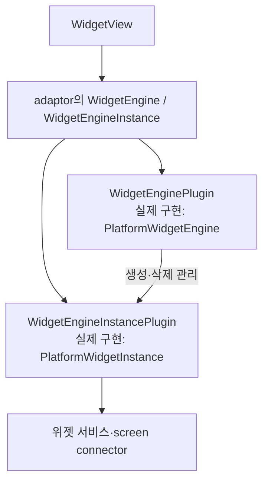
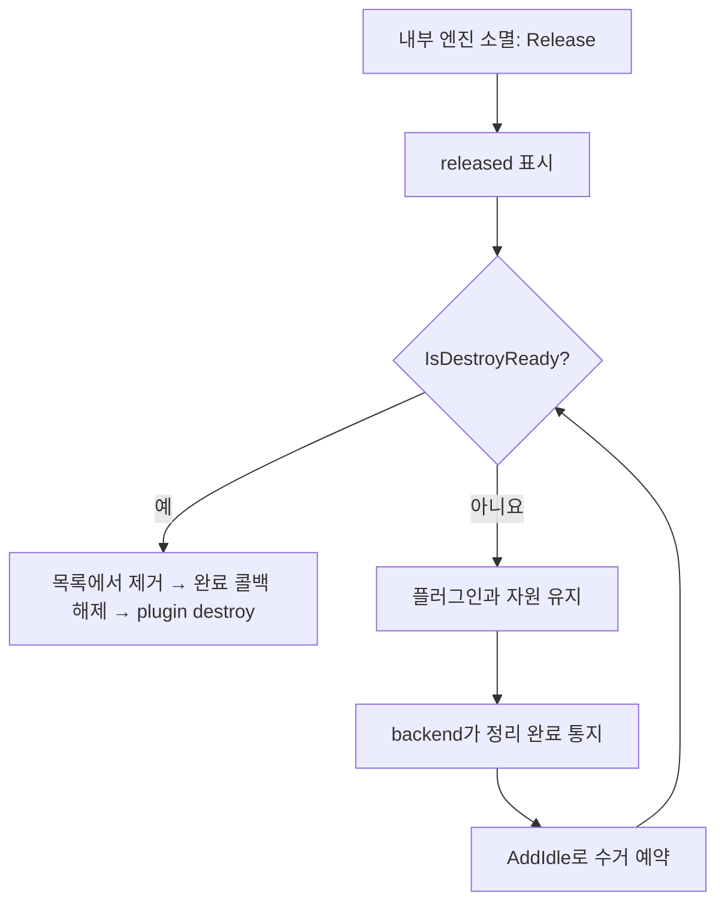
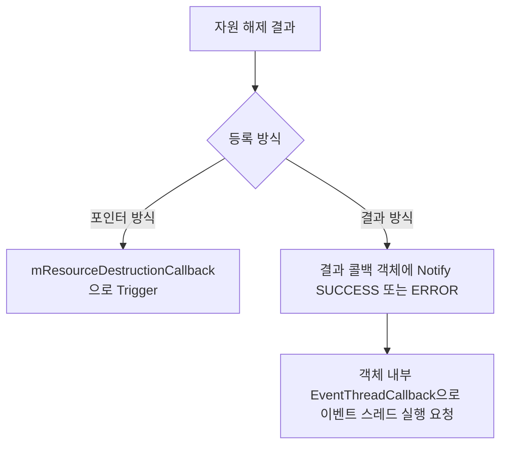
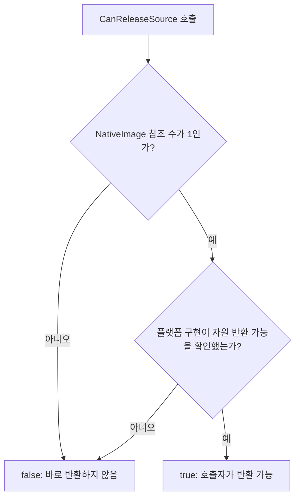
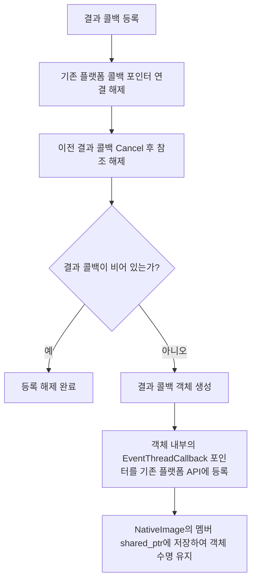
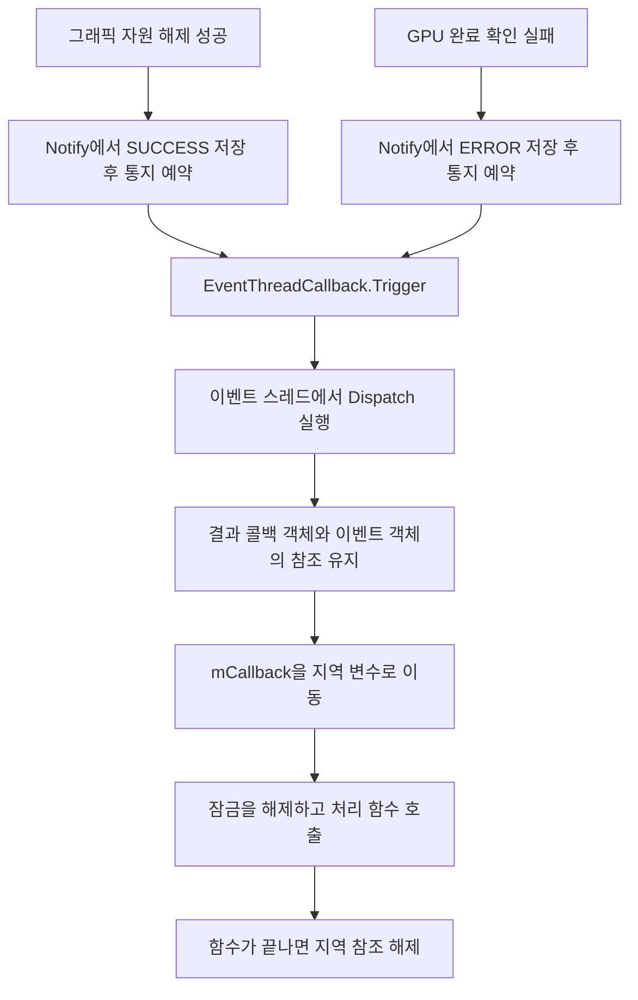
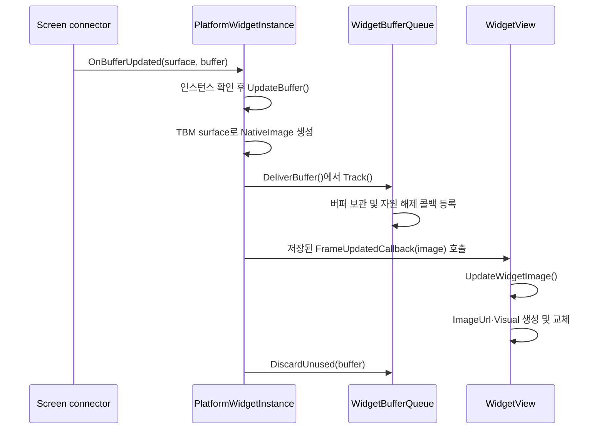
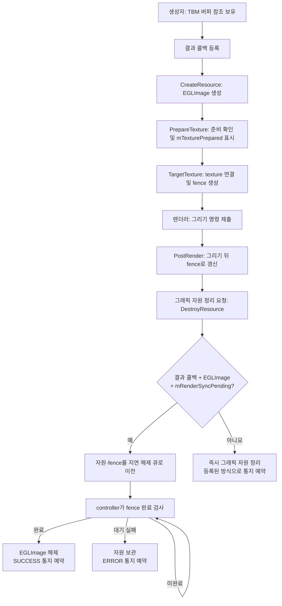
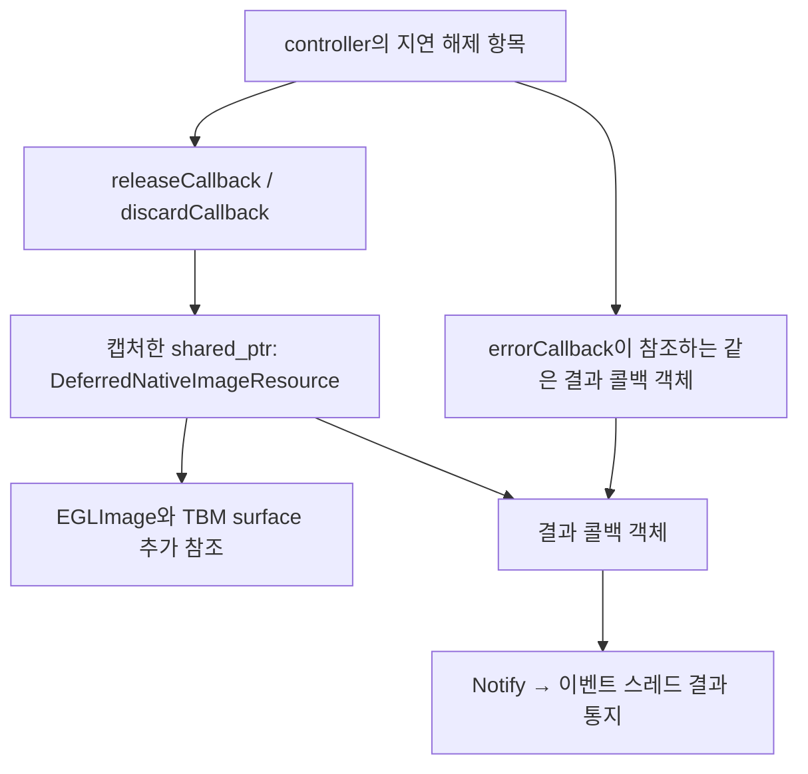

# WidgetView 구조와 수명

이 문서는 `Dali::Ui::WidgetView`가 플랫폼 위젯을 생성하고 화면에 표시하는 전체
흐름을 설명한다. 앞부분은 앱과 UI 개발자가 구조를 빠르게 이해하기 위한 요약이고,
뒤의 [상세 구현 참고](#상세-구현-참고)는 adaptor 플러그인, NativeImage,
EGL fence와 버퍼 반환 수명을 구현하는 개발자를 위한 내용이다.

## WidgetView와 WidgetApplication

Tizen 위젯은 **보여 주는 쪽**과 **그리는 쪽**이 서로 다른 프로세스에 있을 수 있다.

- `WidgetView`는 viewer 앱 안에 있는 DALi UI View다. 위젯 프레임을 받아 Visual로
  표시하고 레이아웃, 입력, Pause·Resume, 로딩·오류 UI를 담당한다.
- WidgetApplication은 위젯 콘텐츠를 실제로 그리는 provider다. widget-service의
  요청을 받아 인스턴스를 만들고 공유 화면 버퍼에 픽셀을 기록한다.
- widget-service는 viewer와 provider 사이에서 인스턴스 생성, 수명, 이벤트를
  중계한다. provider가 종료되면 viewer 쪽 backend에 이를 알린다.

WidgetView 하나는 플랫폼 위젯 인스턴스 하나에 대응한다. 같은 `widgetId`로 여러
WidgetView를 만들 수 있으며, 플랫폼은 각각을 서로 다른 `instanceId`로 관리한다.
같은 provider 프로세스가 여러 인스턴스를 그릴 수도 있으므로 provider 프로세스와
위젯 인스턴스는 같은 개념이 아니다.

`WidgetView::New()`의 `appId`는 viewer 앱을 widget-service에 식별하는 값이고,
`widgetId`는 표시할 위젯의 ID다. 유효한 WidgetView가 반환돼도 provider의 생성과
첫 프레임 도착은 아직 끝나지 않았을 수 있다.

```text
viewer 앱 프로세스                         provider 프로세스

WidgetView                                 WidgetApplication
   │                                               │
   │ 생성·상태·입력 요청                           │ 프레임 그림
   ▼                                               ▼
WidgetEngine ── widget-viewer-dali ── widget-service / screen connector
   ▲                                               │
   └──────── 이벤트와 NativeImage 프레임 ──────────┘
```

## dali-ui에 맞춘 현재 구조

앱은 `WidgetView`만 직접 사용한다. WidgetEngine과 플랫폼 플러그인은 WidgetView의
내부 구현 계층이며 앱이 인스턴스 수명을 따로 관리할 필요가 없다.

| 위치 | 구성 요소 | 역할 |
| --- | --- | --- |
| dali-ui | `WidgetView` | 위젯 인스턴스를 보유하고 전달받은 프레임을 Visual로 표시한다. |
| dali-adaptor | `WidgetEngine`·`WidgetEngineInstance` | UI 요청과 backend 콜백을 플랫폼 중립 API로 전달한다. |
| widget-viewer-dali | `PlatformWidgetEngine`·`PlatformWidgetInstance` | widget-service 세션과 플랫폼 인스턴스를 관리한다. |
| widget-viewer-dali | `WidgetBufferQueue`·`WidgetBuffer` | 전달한 버퍼를 추적하고 안전하게 반환할 때까지 보관한다. |
| dali-adaptor | `NativeImage`와 graphics controller | 공유 버퍼를 그래픽 자원에 연결하고 GPU 사용 완료를 추적한다. |

첫 WidgetView를 만들 때 엔진과 widget-service 세션을 초기화한다. 엔진은
`SingletonService`에 등록되어 viewer 앱 수명 동안 공유된다. 따라서 모든
WidgetView를 삭제한 뒤 다시 만들어도 같은 세션을 사용하고, 같은 프로세스에서
만드는 모든 WidgetView는 동일한 viewer `appId`를 사용해야 한다.

이 구조에는 공개 `WidgetViewManager`가 없다. 앱은 `WidgetView::New()`로 각 View를
만들고 일반 DALi Actor처럼 부모에 Add하거나 Remove한다. 공개 `TerminateWidget()`도
없다. 마지막 참조가 사라져 WidgetView가 실제로 소멸하면 내부 인스턴스 삭제가
요청된다.

엔진을 모든 View보다 오래 유지하는 이유는 같은 프로세스에서 widget-service를
`fini → init`한 뒤 provider 종료 알림이 누락되는 플랫폼 동작을 피하기 위해서다.
이 정책 자체가 View별 인스턴스와 프레임을 앱 종료까지 보관한다는 뜻은 아니다.
View가 소멸하면 해당 자원 정리를 시작하고, GPU가 사용하는 자원만 지연 정리가
끝날 때까지 남는다. 서비스 연결과 사용한 widget ID의 작은 등록 정보는 앱 종료까지
유지될 수 있다.

## 앱에서 보는 수명

일반적인 사용 흐름은 다음과 같다.

```cpp
auto widget = Dali::Ui::WidgetView::New(viewerAppId,
                                        widgetId,
                                        contentInfo,
                                        width,
                                        height,
                                        updatePeriod);

widget.WidgetAddedSignal().Connect(...);
widget.WidgetFaultedSignal().Connect(...);
parent.Add(widget);
```

초기 엔진 이벤트와 보관 중인 첫 프레임은 `New()`가 반환된 다음 이벤트 루프에서
연결한다. 앱이 바로 Signal을 등록할 시간을 주기 위한 순서다. 반대로 그 전에 View가
소멸하면 예약된 초기 콜백은 실행되지 않는다.

| 앱 동작 | 실제 동작 |
| --- | --- |
| `New()` | 엔진을 얻고 플랫폼 인스턴스를 만든다. 아직 provider 생성 완료를 뜻하지 않는다. |
| 장면에 Add | View가 보이고 화면 안에 있으면 Resume한다. |
| 장면에서 Remove | 인스턴스를 삭제하지 않고 Pause한다. 마지막 프레임과 콜백을 유지한다. |
| `PauseWidget()` | 장면 상태와 별개인 수동 Pause 요청을 기록한다. |
| `ResumeWidget()` | 수동 Pause만 해제한다. 숨김·장면 분리·화면 밖이면 계속 Pause 상태다. |
| 핸들 하나를 Reset | 해당 참조만 해제한다. 부모나 다른 핸들이 보유하면 View는 살아 있다. |
| 마지막 참조 해제 | 콜백을 끊고 인스턴스와 이미지 자원 정리를 시작한다. |

WidgetView는 다음 중 하나라도 만족하면 Pause한다.

- 장면에 연결되지 않았다.
- 자신이나 조상 때문에 실제로 보이지 않는다.
- `PauseWidget()`으로 수동 Pause가 설정됐다.
- 현재 렌더 위치가 창 영역을 완전히 벗어났다.

부모의 이동·크기·배율·회전으로 화면 안팎 판정이 달라질 수 있으므로 world position,
size, scale, orientation 변경을 모두 관찰한다. Actor를 부모에서 Remove하는 것과
WidgetView를 소멸시키는 것은 명확히 다른 동작이다.

## 프레임이 표시되는 과정

provider가 그린 버퍼는 screen connector를 통해 backend에 도착한다. backend는
버퍼를 추적 대상으로 먼저 등록하고 NativeImage로 감싼 다음 WidgetView의 내부
프레임 콜백으로 전달한다.

```text
WidgetApplication이 버퍼를 그림
  → screen connector가 갱신을 알림
  → backend가 버퍼를 추적하고 NativeImage 생성
  → WidgetView가 ImageUrl과 ImageVisual 생성
  → 이전 Visual을 새 Visual로 교체
  → GPU 사용 완료 뒤 버퍼를 provider에 반환
```

WidgetView는 프레임마다 새 ImageUrl과 Visual을 만든다. 같은 Texture의 내용을
바꾸는 구조가 아니다. Visual의 해제 정책은 `DESTROYED`이므로 View를 장면에서
잠시 제거해도 마지막 프레임을 유지한다. provider fault에서는 이전 Visual을
등록 해제하고, View가 소멸하면 남은 Visual도 함께 정리된다.

첫 프레임을 전달할 수 있게 되면 `WidgetAddedSignal()`을 보낸다. 이 Signal은
실제 디스플레이에 픽셀이 나타났다는 완료 통지가 아니라, 첫 프레임이 UI로 전달될
준비가 됐다는 의미다. `WidgetContentUpdatedSignal()`도 매 프레임 콜백이 아니라
widget-service의 콘텐츠 변경 이벤트다.

UI가 Visual을 교체했다고 provider 버퍼를 바로 반환할 수는 없다. GPU가 이전
Visual의 NativeImage를 아직 읽고 있을 수 있기 때문이다. 이 때문에 NativeImage의
지연 자원 해제 결과를 받은 뒤에만 backend가 버퍼를 반환한다. 구체적인 fence와
콜백 수명은 [그래픽 자원 해제와 버퍼 반환](#그래픽-자원-해제와-버퍼-반환)에서
설명한다.

## provider 오류와 복구

이미 생성된 provider가 종료되면 backend는 인스턴스별로 자동 재실행을 시도한다.
최대 횟수는 5회이고 시간 경과나 정상 재생성으로 초기화하지 않는다. 초기 CREATE가
완료되기 전의 실패는 자동 재실행하지 않으며 앱이 명시적으로 재시도할 수 있다.

복구 여부는 종료 원인이 crash, 업데이트, 재설치인지 분류해서 결정하지 않는다.
viewer가 해당 인스턴스를 제거했는지, 그리고 생성 완료된 활성 인스턴스에 provider
fault 또는 APP_DEAD가 전달됐는지를 기준으로 판단한다.

| 종료 상황 | 자동 복구 |
| --- | --- |
| WidgetView의 마지막 참조 해제로 해당 인스턴스를 정상 제거 | 하지 않음 |
| viewer 앱 또는 WidgetEngine 종료 | 하지 않음 |
| 장면에서 Remove하거나 수동 Pause | 종료가 아니므로 복구 대상이 아님 |
| 활성 상태인 생성 완료 인스턴스의 provider가 crash 또는 자체 종료 | 최대 5회 시도 |
| provider 업데이트·재설치 과정에서 활성 인스턴스에 APP_DEAD가 전달됨 | 같은 provider 종료로 처리하며 재실행을 시도할 수 있음 |
| 최초 CREATE 완료 전 생성 실패 | 자동 복구하지 않고 명시적 재시도를 기다림 |

따라서 viewer가 요청한 정상 인스턴스 삭제에는 복구가 붙지 않는다. 반면 provider가
스스로 정상 종료했더라도 활성 WidgetView가 남아 있고 플랫폼이 이를 APP_DEAD로
알리면 backend에서는 crash와 구분할 정보가 없어 복구 대상으로 처리한다. 재설치나
업데이트 중 실제 재실행 성공 여부는 새 provider를 다시 실행할 수 있는 시점인지에
따라 달라진다.

`ActivateFaultedWidget()`은 fault 상태의 인스턴스에만 동작한다. 자동 복구 횟수를
0으로 초기화하고 새 실행을 요청한다. 재시도 UI가 보이는 동안에는 한 터치 시퀀스의
일부가 이전 provider로 전달되지 않도록 모든 터치를 차단하고, UP 이벤트로 명시적
재시도를 실행한다.

이벤트 순서는 다음과 같다.

| 상황 | Signal |
| --- | --- |
| 첫 프레임 전달 가능 | `WidgetAddedSignal()` |
| 첫 프레임 전에 생성 중단 | `WidgetCreationAbortedSignal()` |
| 이미 표시한 provider에 fault 발생 | `WidgetDeletedSignal()` 후 `WidgetFaultedSignal()` |
| 첫 프레임 전 provider fault | `WidgetFaultedSignal()` |
| 복구 후 첫 프레임 | `WidgetAddedSignal()`을 다시 전달 |

여기서 `WidgetDeletedSignal()`은 WidgetView 객체나 플랫폼 인스턴스 삭제가 아니라
fault로 이전 표시 콘텐츠를 잃었다는 의미다. 장면에서 Remove하거나 View가 정상
소멸할 때는 이 Signal을 보내지 않는다.

## 레이아웃과 상태 UI

`New()`의 width와 height는 최초 provider 픽셀 크기이면서 WRAP_CONTENT의 논리적
natural size가 된다. 이후 레이아웃이 크기를 바꾸면 WidgetView는 실제 배치 크기를
provider에 정수 픽셀로 전달하고, UI scale을 제거한 실수 크기를 natural size로
보관한다. 정수 반올림 결과를 다시 natural size로 사용하지 않아 fractional scale에서
크기가 반복해서 줄어드는 것을 막는다.

`SetKeepWidgetSize(true)`이면 레이아웃이 바뀌어도 provider 크기와 natural size를
유지한다. 다시 false로 바꾸는 것만으로 즉시 resize하지 않으며, 다음 레이아웃 또는
크기 변경 때 새 크기를 적용한다.

WidgetView 내부에는 실제 프레임 Visual 외에 preview, loading label, retry label이
겹쳐 있다. 이 자식들은 WidgetView가 Dali UI 레이아웃뿐 아니라 Window에 직접
추가되는 경우에도 전체 영역을 채우도록 명시적 크기를 사용한다. corner 속성과
사용자가 설정한 shader effect는 새 프레임 Visual에도 다시 적용한다.

마우스와 터치는 provider로 전달하고 포커스를 받은 키 이벤트와 wheel 이벤트도
전달한다. 접근성은 provider의 원격 접근성 트리를 WidgetView의 자식처럼 연결하며,
장면 위치와 표시 상태가 바뀔 때 원격 자식 위치와 노출 상태를 동기화한다.

## 공개 API를 읽을 때 주의할 점

- 앱 기능은 `New()`, typed getter·setter, Pause·Resume, fault 활성화와 Signal로
  제공한다. 같은 기능을 위한 generic Property도 있지만 event-side property이며
  애니메이션 가능한 property가 아니다.
- `GetContentInfo()`와 `GetUpdatePeriod()`는 마지막으로 정상 조회한 값을 반환할 수
  있다. 주기 변경 이벤트에서는 저장값을 갱신한 뒤 Signal을 보낸다.
- `PREVIEW`는 preview 사용 여부를 나타내는 BOOLEAN이다. 실제 표시 여부는 loading
  상태와 조상 visibility에도 영향을 받는다.
- `PERMANENT_DELETE`는 호환성을 위해 남은 deprecated property이며 현재 동작을
  추가하지 않는다.
- `SetFrameUpdatedCallback()`과 `SetEventCallback()`은 adaptor의 내부
  WidgetEngineInstance API다. WidgetView 앱이 직접 등록하는 공개 Signal과 구분한다.

## 구현상 특이점

현재 구현을 수정하거나 리뷰할 때 다음 조건을 함께 봐야 한다.

1. 공유 엔진은 일반적인 전역 Manager API가 아니라 앱 수명 동안 유지되는 내부
   WidgetEngine 핸들이다. 인스턴스는 여전히 WidgetView마다 따로 존재한다.
2. 콜백 등록 시 backend가 보관 중인 이벤트나 프레임을 동기적으로 재생할 수 있어,
   WidgetView는 등록 자체를 다음 이벤트 루프로 미루고 콜백 처리 중 자신을 보관한다.
3. 첫 프레임 이벤트, 프레임 콜백, 실제 렌더 완료는 서로 다른 시점이다.
4. View의 장면 분리는 Pause이고 마지막 참조 해제는 인스턴스 삭제다.
5. 버퍼 수명은 C++ 참조 수만으로 결정하지 않는다. GPU 완료, 지연 해제 큐,
   provider 반환까지 모두 끝나야 한다.
6. 결과 콜백 방식을 등록한 Tizen GLES NativeImage만 fence 기반 지연 해제를 사용한다.
   기존 NativeImage 콜백 경로의 동작은 유지한다.
7. 같은 NativeImage를 독립적인 여러 GL 컨텍스트에서 동시에 사용하는 경우 마지막
   fence 하나만으로 모든 사용 완료를 보장하지 못하는 알려진 제한이 있다. 일반적인
   단일 창 WidgetView 경로에서 바로 발생하는 조건은 아니다.

## 상세 구현 참고

이하 내용은 위 구조의 소유권, 콜백 재진입, NativeImage와 EGL 자원 해제를 코드
수준에서 확인할 때 참고한다. 앱에서 WidgetView를 사용하는 데 반드시 필요한
내용은 아니다.

### adaptor와 widget backend의 계약

버퍼는 provider가 픽셀을 기록한 메모리다. 이 경로에서 NativeImage는 받은 TBM
surface를 감싸는 객체이고, Texture와 Visual은 그 이미지를 그리는 데 사용된다.
객체가 여러 개 등장한다고 각 단계에서 픽셀 전체를 복사하는 것은 아니다.

`widget-engine-plugin.h`의 두 추상 클래스는 UI와 플랫폼 구현 사이의 계약이다.
adaptor는 이 인터페이스로 호출하고, widget-viewer-dali가 실제 서비스·인스턴스
처리를 구현한다.



`WidgetEngineInstancePlugin`은 위젯 인스턴스 하나의 메타데이터, Pause·Resume,
입력 전달, 크기·표시 상태, 이벤트·프레임 통지를 제공한다. 인스턴스 삭제는
`WidgetEnginePlugin::DestroyWidget()`으로 요청한다. 이 요청이 들어온 시점과
플랫폼 객체·버퍼의 실제 정리가 끝나는 시점은 다를 수 있다.

`WidgetEnginePlugin`은 초기화와 인스턴스 생성·삭제 외에 다음 수명 계약을 갖는다.

| 함수 | 역할 |
| --- | --- |
| `IsDestroyReady()` | 인스턴스와 자원 정리가 끝나 플러그인을 삭제할 수 있는지 조회한다. |
| `SetDestroyReadyCallback()` | 지연 정리 완료를 이벤트 스레드에서 알린다. host는 이 통지 호출 안에서 플러그인을 직접 삭제하지 않는다. |
| `Stop()` | 렌더링 중단 전 adaptor의 OnStop에서 호출한다. provider 활동·타이머·앱 통지를 멈추고 graphics가 사용하는 버퍼는 보관한다. |
| `DetachFromAdaptor()` | adaptor의 OnDestroy에서 콜백 소유자와 플랫폼 연결을 분리한다. GPU 완료를 기다리지 않는다. |

`Stop()`과 `DetachFromAdaptor()`는 여러 번 호출해도 안전해야 한다. `Stop()`은
앱 콜백을 발생시키지 않는다. 개별 WidgetView의 수동 Pause와 엔진 종료 처리는
서로 다른 동작이다.

정상 플러그인 수거는 host의 핸들 참조가 해제되고 `IsDestroyReady()`도 true일 때
진행한다. backend는 인스턴스·버퍼 큐·대기 중인 플랫폼 삭제 요청이 모두 비었는지
확인한다. 완료 통지를 받으면 host는 현재 backend 호출이 돌아온 뒤 삭제할 수
있도록 수거를 예약한다. 통지 중인 객체를 그 자리에서 삭제하지 않기 위한 계약이다.

WidgetView 경로에서는 SingletonService가 공유 엔진을 앱 수명 동안 유지하므로,
모든 View를 삭제했다고 이 조건만으로 엔진이나 서비스 세션을 종료하지 않는다.

#### adaptor 내부 핸들과 참조 관계

`widget-engine-impl.h`의 내부 `WidgetEngine`과 `WidgetEngineInstance`는
`BaseObject`를 상속하며 공개 핸들이 참조하는 실제 adaptor 객체다. 플랫폼 서비스
객체와는 별개이고, 기능 호출은 각 객체의 `mPlugin`을 통해 backend에 전달한다.

인스턴스의 `mEngine`은 `IntrusivePtr<WidgetEngine>`다. 엔진을 강하게 참조하여
인스턴스의 삭제 요청을 전달할 때까지 엔진이 살아 있도록 한다. 엔진과 인스턴스의
`mPlugin`은 raw pointer이며 각각 다른 타입을 가리킨다.

| 멤버 | 대상과 수명 처리 |
| --- | --- |
| 내부 인스턴스의 `mEngine` | 내부 엔진을 강하게 참조한다. |
| 내부 인스턴스의 `mPlugin` | `WidgetEngineInstancePlugin`을 가리킨다. 인스턴스 소멸자가 엔진의 `DestroyWidget()`으로 삭제를 요청한다. |
| 내부 엔진의 `mPlugin` | `WidgetEnginePlugin`을 가리킨다. 엔진 소멸자는 adaptor의 플러그인 보관 객체에 사용 종료를 알린다. 자원이 남으면 플러그인은 더 오래 유지된다. |

마지막 인스턴스 핸들이 해제되면 내부 인스턴스의 소멸자가 backend 콜백을 해제하고,
`mEngine->DestroyWidget(mPlugin)`으로 삭제를 요청한다. 그 뒤 멤버 소멸로
`mEngine` 참조가 내려간다. 내부 엔진에는 adaptor 인스턴스를 강하게 보유하는
멤버가 없어 이 두 객체 사이에 강한 참조의 순환은 없다.

내부 객체의 복사 생성·대입은 금지한다. 공개 핸들 복사는 가능하며 같은 내부 객체의
참조를 늘리는 동작이다. `GetImplementation()`은 빈 핸들을 assert로 검사하고
내부 객체의 참조를 반환할 뿐, 새 객체를 생성하지 않는다.

#### 플러그인 로딩과 수거

`widget-engine-impl.cpp`의 `WidgetEnginePluginObject`는 이벤트 스레드에서
플러그인 라이브러리와 생성된 엔진 플러그인 객체들을 보관하고 adaptor의 종료를
관찰한다. UI의 공유 엔진이나 widget-service 세션 자체와는 별도 수명 관리 계층이다.

| 내부 타입 | 보관하는 것 |
| --- | --- |
| `WidgetPlugin` | 하나의 `.so` 핸들과 `CreateWidgetEnginePlugin`·`DestroyWidgetEnginePlugin` 함수 포인터 |
| `Plugin` | 생성된 엔진 플러그인 객체 하나, 연결된 adaptor 주소, host 사용 종료 표시 |
| `WidgetEnginePluginObject` | 위 라이브러리 보관 객체와 엔진 플러그인 보관 항목 목록 |

엔진 생성 시 `DALI_WIDGET_ENGINE_PLUGIN` 환경변수가 있으면 그 경로를 사용하고,
없으면 `libdali2-widget-engine-plugin.so`를 연다. 호스트 테스트는 이 경로 설정으로
테스트용 backend를 선택하거나 로딩 실패를 검사한다. 일반 제품 경로는 기본
라이브러리를 사용한다. 두 진입 함수를 찾은 라이브러리를
보관하며 이후 생성에서도 재사용한다. 라이브러리 로딩·필수 심볼 조회·플러그인 생성이
실패하면 빈 엔진 핸들을 반환한다. 초기화가 실패한 플러그인도 보관 목록의 사용 종료
표시와 자원 정리 완료 조건을 통해 수거한다.

엔진 소멸자는 플러그인을 직접 delete하지 않고 `Release()`로 사용 종료를 표시한다.
`CollectReleasedPlugins()`는 `released && IsDestroyReady()`인 항목만 수거한다.
이미 준비된 객체는 즉시 수거할 수 있고, 자원 정리가 남았다면 완료 통지를 받아
`AddIdle()`로 현재 호출이 반환된 뒤의 수거를 예약한다. 실제 삭제 전에 목록에서
항목을 먼저 제거하고 완료 콜백을 해제한 다음, 라이브러리의 destroy 함수를 호출한다.



adaptor OnStop에서는 새 엔진 생성을 막고 연결된 플러그인에 `Stop()`을 호출한다.
OnDestroy에서는 `Stop()`과 `DetachFromAdaptor()`를 호출한 뒤 adaptor 연결을
비운다. 이 순회 중에는 `mReleasingResources`로 수거를 억제하고, 순회가 끝난 뒤
다시 수거한다. 다음 adaptor가 생겨도 이전 항목에 새 adaptor의 종료 통지를 보내지 않는다.

플러그인 객체가 모두 없어져도 라이브러리는 프로세스 종료까지 보관한다. 대기 중인
함수가 플러그인의 코드를 실행할 수 있기 때문이다. 정적 보관 객체의 종료 정리는
남은 항목을 먼저 제거·파괴하고 이후 라이브러리를 닫는 순서다.

### 혼동하기 쉬운 콜백

| 등록 API 또는 필드 | 등록 대상 | 등록하는 쪽 → 호출받는 쪽 | 의미 |
| --- | --- | --- | --- |
| `ScreenConnectorOps::updated_cb` | Screen connector | backend → backend의 `OnBufferUpdated()` | 플랫폼으로부터 화면 버퍼가 도착했다. |
| `SetFrameUpdatedCallback()` | `WidgetEngineInstance` | WidgetView → WidgetView의 `UpdateWidgetImage()` | 이 위젯의 새 프레임을 표시할 수 있다. |
| `SetEventCallback()` | `WidgetEngineInstance` | WidgetView → WidgetView의 `HandleEngineEvent()` | 생성, 콘텐츠·주기 변경, 생성 중단, provider 오류 이벤트가 발생했다. |
| `DevelNativeImage::SetDeferredResourceDestruction()` | `NativeImage` | WidgetBuffer → WidgetBuffer가 등록한 처리 함수 | 지연 해제를 설정하고, 성공 또는 GPU 완료 확인 실패를 결과 콜백으로 받는다. |

`SetFrameUpdatedCallback()`은 위젯 인스턴스 전용 API다. NativeImage나
NativeImageSource의 공통 프레임 변경 API가 아니다. `NativeImagePtr`는 이 콜백이
프레임을 전달하는 인자다. NativeImage의 픽셀 변경 자체가 이 콜백을 발생시키지 않는다.

프레임 콜백은 viewer의 렌더링 완료나 실제 화면 표시 완료를 뜻하지 않는다.
WidgetView는 콜백을 받은 뒤 표시할 Visual을 교체하고, 그래픽 처리는 이어서 진행된다.

#### 기존 Toolkit/NUI viewer의 자원 해제 콜백과 비교

기존 viewer도 `SetResourceDestructionCallback(image, EventThreadCallback*,
ownedCallback)`으로 자원 해제 통지를 받아 버퍼를 반환한다. 현재 ECORE/TCORE
구현은 콜백 풀에서 얻은 포인터와 `false`를 전달한다. 콜백 객체의 소유권은 viewer에
남으며, `OnResourceDestruction()`에서 `DeleteBuffer()`를 호출한다.

WidgetEngine 경로는 지연 해제와 결과 통지를 함께 설정하는 함수인
`SetDeferredResourceDestruction(image, std::function<void(ResourceDestructionResult)>)`를
사용한다. Tizen GLES에서는 GPU 완료 추적을 활성화하며, 결과 콜백으로 성공과
실패를 구분한다. 이 함수 자체가 자원 해제를 요청하는 것은 아니다.

| 구분 | 포인터 콜백 형식 | 결과 콜백 형식 |
| --- | --- | --- |
| 전달 내용 | 결과 인자 없는 해제 통지 | `SUCCESS` 또는 `ERROR` |
| 이벤트 전달 객체 | 호출자가 준비하고 소유권 플래그를 지정 | 결과 콜백 객체가 관리 |
| 버퍼 처리 | 해제 통지를 받으면 반환 경로로 진행 | 성공이면 반환, 오류이면 보관하고 큐 수용 차단 |
| 통지 수명 | 기존 viewer의 콜백 풀과 취소·재사용 보호로 관리 | 등록당 한 번 통지하며 빈 함수로 대기 통지도 취소 |

두 API는 독립적으로 누적 설정하지 않는다. 그래픽 사용 전에 사용할 방식을 선택하며,
마지막 등록이 이전 등록을 교체한다.

| 등록 순서 | Tizen GLES의 최종 설정 |
| --- | --- |
| `SetResourceDestructionCallback()` → 비어 있지 않은 `SetDeferredResourceDestruction()` | 기존 콜백을 정리하고 GPU 완료 추적·지연 해제·결과 통지를 사용한다. |
| `SetDeferredResourceDestruction()` → `SetResourceDestructionCallback()` | 결과 통지를 취소하고 지연 해제 설정을 해제한 뒤 기존 콜백을 사용한다. |
| 빈 함수로 `SetDeferredResourceDestruction()` 호출 | 등록과 지연 해제 설정을 해제하고 대기 중인 결과 통지를 취소한다. |

이미 큐에 넘긴 자원은 등록 교체나 해제 이후에도 큐에서 계속 정리한다. 이전 결과는
교체된 콜백으로 넘기지 않는다. 지연 해제 큐의 처리와 결과 통지 취소는 별개다.

결과 콜백 형식도 내부적으로 `EventThreadCallback`을 사용해 이벤트 스레드에 통지한다.
GPU 완료 대기는 콜백 형식 자체가 아니라 Tizen NativeImage와 그래픽 controller의
구현이 담당한다. Tizen GLES에서는 결과 콜백을 등록한 이미지에만 fence 생성과
지연 해제를 적용한다. 기존 포인터 형식은 EGLImage 해제 후 콜백을 예약하는 경로를
사용하며, 이 경로의 fence 생성이나 `glFinish()` 대기를 사용하지 않는다.
콜백을 등록하지 않은 이미지도 이 GPU 완료 추적을 사용하지 않는다.

적용 여부는 `TargetTexture()`, `PostRender()`, `DestroyResource()` 세 곳에서
`mResourceDestructionResultCallback`으로 확인한다. 기존 이벤트 콜백 포인터와
함께 검사하거나 별도 멤버 flag를 두지 않는다. 결과 콜백 형식도 살아 있는 그래픽 자원과 완료 추적
상태가 있어야 지연 해제 큐로 넘어간다. 정상 경로는 완료 여부를 대기 시간 0으로
조회하고 미완료 자원을 보관한다. GLES 2이거나 fence 생성에 실패한 경우에는
`glFinish()`로 기다리는 대체 경로를 사용한다.

이 구분은 위젯 여부에 따른 것이 아니다. 다른 사용자도 결과 콜백을 등록하면
같은 처리를 사용한다. 이 설명은 Tizen GLES에 해당하며 다른 플랫폼과 Vulkan까지
같은 완료 추적을 구현했다는 뜻은 아니다.

#### Tizen GLES의 포인터·결과 콜백 경로 분리

Tizen GLES는 포인터 콜백과 결과 콜백을 각자의 경로로 통지한다. 결과 콜백 등록 시
결과 콜백 객체 내부의 이벤트 포인터를 기존 멤버에 복사하지 않는다.



`mResourceDestructionCallback`은 포인터 형식만 보관한다. 결과 방식은 성공과
오류 모두 `NativeImageResourceDestructionResultCallback::Notify(result)`를 통해
전달한다. 이벤트 객체의 생성·취소·실행 중 수명은 결과 콜백 객체 안에서 관리한다.

지연 해제를 시작할 때는 활성 등록을 다음처럼 옮긴다.

```cpp
mDeferredResultCallback = std::move(mResourceDestructionResultCallback);
```

| 상태 | 활성 결과 등록 | 지연 해제에 넘긴 결과 등록 | 기존 이벤트 포인터 |
| --- | --- | --- | --- |
| 결과 콜백 등록 | `mResourceDestructionResultCallback`에 보관 | 없음 | 없음 |
| 지연 해제 큐로 이전 | 없음 | `mDeferredResultCallback`에 보관 | 없음 |
| 기존 콜백 등록 | 없음 | 없음 | `mResourceDestructionCallback`에 보관 |

이동할 때 콜백 객체를 하나 더 만들지 않는다. 지연 자원도 같은 결과 콜백 객체를
참조하고, NativeImage는 `mDeferredResultCallback`을 통해 그 통지를 취소할 수
있다. 콜백 교체·해제·NativeImage 소멸 시 활성 등록과 지연 등록을 모두 취소한다.
통지를 취소해도 이미 큐에 넘긴 EGLImage와 TBM surface의 GPU 완료 대기는 계속된다.
지연 등록은 결과 전달 후 소유자가 정리할 때까지 남을 수 있으며, 이 멤버의 존재가
GPU 작업이 아직 끝나지 않았다는 의미만을 갖는 것은 아니다.

결과 콜백 객체의
`Notify()`와 `Cancel()`이 이 경로의 통지·취소를 처리한다. 기존 방식은 별도의
지연 콜백 객체를 만들지 않고 원래 이벤트 포인터와 소유권 플래그를 사용한다.

#### 공개 NativeImage API의 전달과 교체 순서

`native-image-devel.cpp`는 플랫폼별 내부 구현으로 호출을 전달한다. 결과
콜백은 `std::move(resultCallback)`으로 넘기고, 기존 포인터 형식을 등록할 때는 내부
구현의 콜백 포인터를 먼저 교체한 다음 이전 결과 콜백 상태를 취소·정리한다.
두 형식은 하나의 이미지에 동시에 누적 등록되는 구조가 아니다.

이 순서는 내부 구현이 이전 결과 콜백 객체의 이벤트 객체를 가리키고 있을 수
있기 때문에 필요하다. 그 포인터 연결을 먼저 끊고 결과 콜백 객체를 정리해야 한다.
Tizen GLES의 재정의 함수는 활성·지연 결과 등록과 기존 포인터 등록을 정리한다.
공통 기본 구현을 사용하는 다른 플랫폼을 위해 공개 전달 함수의 정리도 유지한다.

`CanReleaseSource()`는 C++ 객체의 참조 수와 플랫폼 자원 상태를 함께 확인한다.



WidgetBufferQueue만 이미지를 보관하더라도, 별도의 지연 해제 큐가 GPU 자원을
유지할 수 있다. 그러므로 참조 수 확인만으로 버퍼를 반환하면 안 된다.
반대로 GPU 자원이 아직 없어도 다른 소비자가 이미지를 보관하면 앞으로 그릴 수
있으므로 바로 반환하면 안 된다. 조회는 이벤트 스레드에서 수행한다.

#### 공통 NativeImage 구현의 콜백 연결

`native-image-impl.h`는 플랫폼별 NativeImage 구현의 공통 기반 클래스를 선언한다.
`native-image-impl.cpp`의 결과 콜백 기본 구현은 기존 포인터 콜백 API를 이용해 연결한다.
Tizen GLES는 이 함수를 재정의하므로 아래 기본 구현을 그대로 실행하지 않는다.

이 문서에서 **결과 콜백 객체**는 `NativeImageResourceDestructionResultCallback` 타입의
객체를 뜻한다. 호출자가 등록한 처리 함수와 이 함수를 실행하기 위한
`EventThreadCallback`을 함께 관리한다. 변수와 실제 객체는 다음처럼 구분한다.

| 코드의 이름 | 의미 |
| --- | --- |
| `resultCallback` | 호출자가 설정 API에 전달한 `std::function<void(ResourceDestructionResult)>` 처리 함수 |
| `notification` | 결과 콜백 객체를 가리키는 지역 `shared_ptr` 변수 |
| `NativeImageResourceDestructionResultCallback` | 실제로 생성하는 결과 콜백 객체의 타입 |
| `mResourceDestructionResultCallback` | 결과 콜백 객체를 계속 유지하는 NativeImage의 멤버 `shared_ptr` |



코드의 대응 위치는 `SetDeferredResourceDestruction()`의 연결 해제·취소,
`NativeImageResourceDestructionResultCallback` 생성,
`SetResourceDestructionCallback(notification->GetEventThreadCallback(), false)`,
`mResourceDestructionResultCallback` 대입이다.

이때 `false`는 플랫폼에 이벤트 콜백 객체의 소유권을 넘기지 않는다는 뜻이다.
플랫폼은 포인터를 빌려 쓰고, 결과 콜백 객체가 이벤트 객체를 보유하며, NativeImage는
멤버 `shared_ptr`로 결과 콜백 객체의 수명을 유지한다. 지역 변수 `notification`에서
멤버로 `std::move`하는 것은 참조를 옮기는 것이며 결과 콜백 객체를 하나 더 만드는
것이 아니다. 등록 함수가 끝나도 멤버에 참조가 남으므로 객체는 살아 있다.
기존 플랫폼이 자원 해제 후 이벤트를 Trigger하면 결과 콜백 객체가 이벤트 스레드에서
등록된 처리 함수에 `SUCCESS`를 전달한다. 이 연결만으로 해당 플랫폼에
GPU fence 대기가 추가되지는 않는다.

`ClearResourceDestructionResultCallback()`은 `Cancel()`로 통지를 취소한 뒤
`shared_ptr`를 해제한다. 다른 곳이 상태 객체를 보유하더라도 이전 수신자와의
연결을 끊는 것과 상태 객체의 참조를 줄이는 것은 별도의 작업이다.

공통 `CanReleaseSource()`는 기본적으로 `false`다. 자원 반환 가능 여부를
확인하는 플랫폼 구현이 없으면 추측해서 즉시 반환을 허용하지 않는다.
Tizen GLES는 이 함수를 재정의해 EGLImage와 지연 해제 상태를 검사한다.

#### 결과 콜백 객체의 통지·취소·실행 중 수명

`native-image-resource-destruction-result-callback.h`의 객체는 GPU 완료를 직접 검사하거나
버퍼를 반환하지 않는다. 받은 결과를 이벤트 스레드에서 등록된 처리 함수에 한 번
전달하고, 그 통지를 취소하는 역할이다.

| 멤버 | 역할 |
| --- | --- |
| `mCallback` | 등록받은 결과 처리 함수 |
| `mEventCallback` | 이벤트 스레드에서 이 객체의 `Dispatch()`를 실행하도록 요청하는 객체 |
| `mResult` | 전달할 결과. 초기값은 `SUCCESS` |
| `mPending` | `Notify()`가 이미 통지를 예약했는지 표시 |
| `mMutex` | 렌더 스레드의 통지와 이벤트 스레드의 취소·실행 사이에서 상태 보호 |

Tizen의 결과 콜백 경로는 성공 시 `Notify(SUCCESS)`, 실패 시 `Notify(ERROR)`를
호출한다. 둘 다 결과를 저장한 뒤 내부 이벤트 객체를 Trigger한다. 공통 기본 구현을
사용하는 다른 플랫폼의 호환 경로에서는 이벤트 객체를 직접 Trigger하며, 그 경우
`mResult`의 초기값 `SUCCESS`를 사용한다.



`Notify()`는 잠금 안에서 `mCallback && !mPending`을 확인해 중복 예약을 막는다.
`Dispatch()`는 처리 함수를 멤버에서 지역 변수로 이동하므로 실행 중 또는 실행 후
다시 통지돼도 같은 처리 함수를 중복 호출하지 않는다. 직접 Trigger하는 경로에서도
이 실행 단계의 보호가 적용된다. 한 번 사용한 객체를 초기화해 재사용하는 대신,
새 자원 해제 결과가 필요하면 콜백을 다시 등록한다.

`Dispatch()`의 지역 변수는 각각 다른 수명을 보호한다.

- `keepAlive = shared_from_this()`: 현재 결과 콜백 객체 자체를 유지한다.
- `event = mEventCallback`: 현재 실행을 전달한 이벤트 객체를 유지한다.
- `callback = std::move(mCallback)`: 실제 실행할 처리 함수와 캡처를 유지한다.

따라서 처리 함수 안에서 자신의 등록을 취소하거나 NativeImage·WidgetBuffer를
정리하더라도 `Dispatch()`가 사용하는 객체는 반환 시점까지 유지된다. 실제 처리
함수는 잠금 밖에서 호출하므로 그 함수가 다시 `Cancel()`을 호출해도 같은 mutex를
중첩해서 잠그지 않는다.

`Cancel()`은 이벤트 스레드에서 처리 함수와 이벤트 객체를 멤버 밖으로 이동한 뒤,
잠금을 풀고 지역 변수 소멸로 정리한다. 이후 `Notify()`는 비어 있는 `mCallback`을
보고 통지하지 않는다. 이미 실행에 들어간 처리 함수는 `Dispatch()`의 지역 변수로
살아 있으므로 중간에 강제 종료하지 않으며, 실행 전의 대기 통지를 취소한다.
공통 기본 구현에서 플랫폼이 빌린 이벤트 포인터는 앞 절의 순서대로 먼저 연결
해제해야 한다. Tizen의 결과 콜백 경로는 이 포인터를 외부 멤버에 보관하지 않는다.

이 수명 처리는 기존 호스트 ASan/UBSan 콜백 검사에서 중복 통지, 취소와 렌더 통지의
경합, 실행 중 자기 등록 해제, 소유 객체 삭제, 교체된 버퍼에 대한 오래된 통지
조건을 확인했다. 이벤트 소스는 대체한 검사이며 실제 GPU 완료 검증은 아니다.

### 생성과 콜백 등록

1. 앱이 `WidgetView::New()`를 호출한다. UI는 공유 엔진을 얻고
   `engine.CreateWidget()`으로 인스턴스를 만든다.
2. backend의 `Launch()`는 `updated_cb = OnBufferUpdated`를 설정해 screen
   connector를 등록한 뒤 provider 실행을 요청한다. 이 단계에서 플랫폼 버퍼를
   받는 경로는 연결되지만, WidgetView의 프레임 콜백은 아직 등록되지 않았다.
3. WidgetView의 `OnInitialize()`는 레이아웃과 입력 처리를 준비하고 장면 밖의
   Pause 상태를 반영한다. 이어서 `EventThreadCallback`으로
   `InitializeEngineCallbacks()` 실행을 예약한다.
4. `New()`가 반환된 뒤 이벤트 루프가 예약된 작업을 처리하면
   `InitializeEngineCallbacks()`가 이벤트 콜백과 프레임 콜백을 등록한다.

등록을 미루는 이유는 등록 도중에 보관 중인 이벤트와 프레임이 즉시 전달될 수 있기
때문이다. 앱이 `New()`에서 핸들을 받고 위젯 시그널을 연결할 기회를 준다.
장면에 `Add()`하는 것이 등록의 조건은 아니다.

WidgetView가 등록하는 프레임 처리 함수는 다음과 같다.

```cpp
mInstance.SetFrameUpdatedCallback([this](Dali::NativeImagePtr image)
{
  UpdateWidgetImage(std::move(image));
});
```

adaptor의 공개·내부 전달 계층을 거쳐 backend는 이 함수를
`mFrameUpdatedCallback`에 저장한다. 매 프레임 다시 등록하지 않고 같은 함수를
반복 호출한다. 등록과 프레임 콜백 호출은 이벤트 스레드에서 수행한다.

`InitializeEngineCallbacks()`는 등록 중 이벤트 처리로 앱의 핸들이 해제될 수 있어
로컬 `keepAlive` 핸들로 WidgetView를 함수가 끝날 때까지 유지한다.

#### 등록 전에 프레임이 도착한 경우

backend의 `UpdateBuffer()`는 프레임 콜백이 없으면 최신 버퍼와 NativeImage 하나를
`mPendingBuffer`·`mPendingImage`에 보관한다. 더 새 프레임이 오면 이전 보관 버퍼를
반환하고 교체한다. 이 프레임들은 아직 그래픽에 전달되지 않았다.

| 순서 | 동작 |
| --- | --- |
| 프레임 A 도착, 콜백 미등록 | A를 보관한다. |
| 프레임 B 도착, 콜백 미등록 | A를 반환하고 B를 보관한다. |
| `SetFrameUpdatedCallback()` 호출 | 콜백을 저장하고 B를 `DeliverBuffer()`로 즉시 전달한다. |
| 이후 프레임 C 도착 | 저장된 콜백으로 C를 전달한다. |

따라서 `SetFrameUpdatedCallback()`이 반환되기 전에 등록한 함수가 실행될 수 있다.
이 등록 시점의 전달도 이벤트 스레드에서 동기적으로 수행된다.

### 등록 후 새 프레임 전달



그림은 유효한 프레임을 정상 전달하는 경로다. `OnBufferUpdated()`는 인스턴스 ID와
프로세스를 확인하며, `UpdateBuffer()`는 제거된 인스턴스, 잘못된 버퍼, 반환 전
중복 버퍼 등의 전달을 차단한다.

`DeliverBuffer()`는 사용자 코드가 실행될 수 있는 콜백보다 먼저 버퍼를 추적한다.
첫 프레임이면 프레임 콜백에 앞서 `ADDED` 이벤트를 전달한다. 그 이벤트의 처리
중에도 위젯이 제거될 수 있으므로 실제 프레임 콜백 호출 전에 제거 상태와 버퍼 큐
오류를 다시 확인한다.

WidgetView의 `UpdateWidgetImage()`는 프레임마다 새 ImageUrl과 Visual을 만들고
기존 Visual을 교체한다. `DESTROYED` 해제 정책으로 장면에서 빠져도 마지막 프레임을
유지한다. 프레임 콜백 등록은 그대로 유지된다.

### provider 오류와 복구 상세

생성된 인스턴스의 provider 종료가 확인되면 backend는 인스턴스별 자동 재실행
횟수를 증가시키고 재실행을 예약한다. 최대 횟수는 5회이며 타이머나 시간 구간으로
초기화하지 않는다. 새 provider가 정상적으로 CREATE에 도달해도 이 횟수는
초기화하지 않으므로, 같은 인스턴스에서 반복되는 종료가 누적된다.

초기 생성이 완료되기 전의 실패는 자동 재실행 대상이 아니다. 자동 복구 한도에
도달했거나 생성이 중단된 경우 앱 또는 재시도 화면에서
`ActivateFaultedWidget()`을 명시적으로 호출할 수 있다. 이 호출은 fault 상태인
인스턴스에 대해서만 자동 복구 횟수를 0으로 초기화하고 재실행을 요청한다.

provider 오류 시 WidgetView는 이전 Visual을 해제하고 재시도 상태를 표시한다.
이미 첫 프레임을 표시한 상태였다면 `WidgetDeletedSignal()`을 먼저 내보내고
`WidgetFaultedSignal()`을 내보낸다. 이는 WidgetView나 플랫폼 인스턴스가 삭제됐다는
뜻이 아니라, 이전에 표시하던 콘텐츠를 잃었다는 알림이다. 복구 후 첫 프레임이
도착하면 `WidgetAddedSignal()`을 다시 내보낸다.

재시도 상태에서는 하나의 터치 시퀀스가 provider에 일부만 전달되지 않도록 모든
터치 이벤트를 차단한다. 그중 UP 이벤트가 명시적 재시도를 실행하며, 이후에는 일반
입력 전달로 돌아간다.

### 그래픽 자원 해제와 버퍼 반환

UI가 이전 Visual을 교체한 시점과 GPU가 이전 버퍼를 다 읽은 시점은 다를 수 있다.
버퍼를 반환하면 provider가 다시 사용할 수 있으므로 정상 렌더 경로는 다음 순서를
따라야 한다.

```text
이전 프레임의 그래픽 자원 정리 요청
  → GPU 사용 완료 확인
  → 그래픽 자원 해제
  → 이벤트 스레드에서 자원 해제 결과 통지
  → backend의 버퍼 추적 정리 및 provider에 반환
```

`WidgetBuffer`는 버퍼를 추적할 때 NativeImage에 결과 콜백을 등록한다.
`SUCCESS`이면 `DeleteBuffer()`로 정리하고 반환한다. `ERROR`이면 GPU 완료를
확인하지 못한 것이므로 해당 버퍼를 보관하고 큐의 새 프레임 수용을 막는다.
아직 GPU 작업을 기다리는 상태에서는 결과 콜백을 호출하지 않는다.
실제 반환 요청은 connector가 살아 있고 버퍼 반환 프로토콜을 지원할 때 전달한다.

NativeImage 객체의 소멸과 그래픽 자원 해제는 별개다. backend가 NativeImage를
보관한 상태에서도 그래픽 자원 해제 통지를 받을 수 있다. `WidgetBuffer` 소멸자는
빈 결과 콜백을 등록해 대기 중인 통지도 취소하므로, 이미 지워진 버퍼 추적 객체를
콜백이 다시 접근하지 않도록 한다.

소비자가 프레임을 보관하지 않았다면 `DiscardUnused()`가
`DevelNativeImage::CanReleaseSource()`를 확인한다. 단독 소유이며 살아 있거나
해제를 기다리는 그래픽 자원이 없는 경우 바로 반환할 수 있다. 이 조회 함수 자체는
자원을 해제하지 않는다. 참조 수가 하나라는 사실만으로 GPU 완료를 판단하지 않는다.

NativeImage의 기존 `AcquireBuffer()`·`ReleaseBuffer()`는 CPU 픽셀 접근을 위한
짝이며, 여기서 설명하는 provider 버퍼 반환과 구별해야 한다.

#### Tizen NativeImage의 버퍼·그래픽 자원 수명

`dali-adaptor/dali/internal/imaging/tizen/native-image-impl-tizen.cpp`는 TBM 버퍼를
EGLImage로 연결하고, 그래픽 자원 해제와 결과 통지를 관리한다. WidgetView는
프레임마다 NativeImage를 만들며 같은 객체의 `SetSource()`로 다음 프레임을
덮어쓰지 않는다.

아래는 결과 콜백을 등록한 이미지의 렌더·해제 흐름이다. 실제 그리기 명령 제출과
지연 해제 큐의 처리는 그래픽 계층에서 수행한다.



**버퍼 보관과 그리기 준비**

생성자는 전달받은 TBM surface의 참조를 늘려 보관한다. `CreateResource()`는
그 surface로 EGLImage를 만들거나 이미 존재하는 EGLImage를 재사용한다.
`PrepareTexture()`가 EGLImage를 확인하고 `mTexturePrepared = true`로 표시하면,
`TargetTexture()`가 EGLImage를 texture에 연결한다. `mTexturePrepared`는 마지막
`PostRender()` 이후의 준비 성공 표시이며 GPU 완료를 뜻하지 않는다. 준비 없이
`PostRender()`가 반복 호출되면 이 표시가 false이므로 fence를 다시 갱신하지 않는다.

`TargetTexture()`는 연결 직후 `mResourceDestructionResultCallback &&
!mRenderSyncPending`이면 fence를 만든다. 그리기까지 가지 않고 해제되는 경우에도
연결 명령의 완료를 추적하기 위한 것이다. 그리기 명령 제출 뒤 `PostRender()`는
`mTexturePrepared && mResourceDestructionResultCallback && mEglImageKHR`이면 fence를
갱신하고, 이번 렌더 과정의 `mTexturePrepared`와 `mEglImageChanged` 표시를 초기화한다.
GLES 2 또는 fence 생성 실패 시에는 `Finish()`로 현재 컨텍스트 작업을 기다린다.

**그래픽 자원 정리와 관리 주체 이전**

`DestroyResource()`는 결과 콜백·EGLImage·`mRenderSyncPending`이 모두 있을 때
지연 해제 큐로 자원을 넘긴다. 결과 콜백 참조를 `mDeferredResultCallback`으로
옮기고, EGLImage와 TBM surface의 추가 참조를 `DeferredNativeImageResource`에
보관한다. controller에는 fence와 성공·오류·종료 정리 함수를 전달한다.

이후 NativeImage의 EGLImage·fence 멤버를 비우고 `mRenderSyncPending`을 false로
바꾼다. 이 시점은 GPU 완료가 아니라 관리 주체가 큐로 바뀐 시점이다. 큐가 TBM
참조를 보유하므로 NativeImage가 먼저 소멸해도 지연 자원은 유지된다.
지연 조건을 만족하지 않으면 즉시 그래픽 자원을 정리하고, 결과 콜백의
`Notify(SUCCESS)` 또는 포인터 콜백의 `Trigger()`로 통지를 예약한다.

**GPU 완료와 결과 전달**

실제 fence 완료 검사는 graphics controller의 `ProcessDeferredNativeImageReleases()`가
담당한다. 완료 시 `DeferredNativeImageResource::Release()`가 EGLImage를 해제하고
`Notify(SUCCESS)`로 이벤트 스레드 통지를 예약한다. 대기 실패 시에는 자원을
보관하며 ERROR를 통지하고, 종료 정리는 `Discard()`로 성공 통지 없이 EGLImage를
정리한다. 보관 객체가 소멸하면 추가 TBM 참조를 내려놓는다.

provider 버퍼 반환은 이후 backend 콜백이 담당한다. TBM 참조를 유지하는 것과
provider의 재사용을 막는 것은 별개이므로, 완료를 잘못 판단해 SUCCESS를 전달하면
참조만으로 픽셀 덮어쓰기를 막을 수 없다.

**콜백 취소·객체 소멸과 미사용 프레임**

`ResetResourceDestructionCallback()`은 활성·지연 결과 통지를 취소하고, 포인터
콜백도 소유권에 맞게 정리한다. 두 setter와 소멸자가 이 함수를 호출한다.
소멸자는 이어서 `DestroySurface()`로 NativeImage 자신의 TBM 참조를 정리한다.
그래픽 자원 정리용 `DestroyResource()`와 NativeImage 소멸자는 별개 경로다.

`CanReleaseSource()`는 EGLImage·fence·큐 이전 대기 표시·지연 결과 등록이 모두
없는지 확인한다. 공개 함수는 참조 수가 하나인지도 확인한다. backend가 그래픽에
쓰이지 않은 프레임을 반환할 수 있는지 조회하는 용도이며, 직접 자원을 해제하지 않는다.

#### Graphics controller의 지연 해제 항목

`EglGraphicsController`는 `mDeferredNativeImageReleases`에 자원 해제 대기 항목을
보관한다. NativeImage가 `AddDeferredNativeImageRelease()`로 항목을 넘기고,
controller의 `PostRender()`에서 완료를 검사하며, 그래픽 종료 시 남은 항목을 정리한다.

| `DeferredNativeImageRelease`의 멤버 | 역할 |
| --- | --- |
| `sync` | 기다릴 GPU fence. null은 큐에 전달된 작업이 이미 완료됐다는 의미다. |
| `releaseCallback` | 완료가 확인됐을 때 그래픽 자원을 해제하고 성공 통지를 예약한다. |
| `errorCallback` | 완료 검사 실패 시 오류 통지를 예약한다. 자원은 보관한다. |
| `discardCallback` | 그래픽 종료 시 성공 통지 없이 남은 EGLImage를 정리한다. |
| `nativeImage`, `nativeSurface` | 로그에 출력하는 식별용 주소. 객체 소유권을 갖거나 이 포인터를 역참조하지 않는다. |
| `firstPoll` | 첫 완료 검사에서 flush 플래그를 지정할지 나타낸다. |
| `waitFailed` | 완료 검사에 실패하여 이후 검사 대상에서 제외됐는지 나타낸다. |

여기서 세 callback은 렌더 스레드에서 수행할 내부 작업 함수다. 앱이나 backend가
등록한 결과 콜백 세 개를 뜻하지 않는다. NativeImage는 성공·종료 작업 함수에
`DeferredNativeImageResource`의 shared_ptr를 캡처하여 자원을 보관한다.
이 내부 함수가 결과 콜백 객체의 `Notify()`를 호출하면 실제 결과 처리 함수는
이후 이벤트 스레드에서 실행된다.



`HasPendingNativeImageReleases()`는 실패하여 보관 중인 항목까지 포함해 큐가
비어 있는지 확인한다. `NeedsNativeImageReleaseProcessing()`은 계속 완료를
검사할 항목이 있는지 확인한다. 실패 항목만 남은 경우 전자는 true, 후자는 false다.
이 구분을 통해 자원 보관은 유지하면서 실패한 fence를 확인하기 위한 추가 렌더
처리를 계속 요청하지 않는다. `DiscardNativeImageReleases()`는 그래픽 종료 시
남은 자원을 정리하며, 완료 확인과 구분하여 SUCCESS를 통지하지 않는다.

#### 해제 대기 상태와 렌더 루프의 연결

렌더 루프는 공통 `GraphicsInterface::NeedsResourceReleaseProcessing()`으로
자원 해제를 위해 추가 처리가 필요한지 조회한다. 기본 구현은 false를 반환한다.
GLES 구현은 controller의 `NeedsNativeImageReleaseProcessing()` 결과를 전달한다.
이 함수 자체는 fence를 기다리거나 자원을 정리하지 않는다.

일반 렌더 사이클에서는 장면 그리기를 생략하더라도 대기 항목이 있으면
`PostRender()`로 완료 검사를 진행한다. 이후에도 검사할 항목이 남으면 idle 진입을
미루어 다음 처리 기회를 유지한다. 이는 화면을 반드시 다시 그린다는 의미가 아니다.
업로드 전용 사이클에는 이 추가 처리 요청을 적용하지 않고, 명시적인 pause·stop이
우선한다. 실패하여 보관만 하는 항목은 추가 처리 필요 상태에서 제외한다.

#### 지연 해제 큐의 처리 순서

`AddDeferredNativeImageRelease()`는 fence와 작업 함수를 목록에 보관할 뿐,
호출 시점에 기다리거나 자원을 해제하지 않는다. controller의 `PostRender()`가
`ProcessDeferredNativeImageReleases()`를 호출하여 검사 가능한 항목을 순회한다.

검사는 `ClientWaitSync(sync, flags, 0)`으로 대기 시간 0을 지정한다. `firstPoll`이
true인 첫 검사에서만 `GL_SYNC_FLUSH_COMMANDS_BIT`를 지정한다. null fence는
이미 완료된 작업으로 취급한다. NativeImage의 GLES 2·fence 생성 실패 경로는
`Finish()`를 수행한 뒤 null fence를 넘긴다.

| 검사 결과 | 목록 처리 | 이후 실행할 작업 |
| --- | --- | --- |
| `GL_ALREADY_SIGNALED`, `GL_CONDITION_SATISFIED` | fence를 삭제하고 항목을 제거한다. | `releaseCallback`으로 자원 해제와 성공 통지를 진행한다. |
| `GL_TIMEOUT_EXPIRED` | 항목을 그대로 보관하고 다음 처리 때 다시 검사한다. | 통지하지 않는다. 미완료는 오류가 아니다. |
| `GL_WAIT_FAILED` | `waitFailed = true`로 표시하고 자원을 계속 보관한다. 이후 검사에서는 제외한다. | `errorCallback`으로 오류를 한 번 통지한다. |

성공·오류 작업 함수는 순회 중 바로 실행하지 않고 지역 `callbacks` 목록으로
옮긴 뒤 순회가 끝나면 실행한다. 작업 함수가 해제 요청을 새로 등록하더라도
순회 중인 vector의 iterator가 무효화되지 않도록 하기 위한 순서다. 성공 항목을
원래 목록에서 제거해도 지역 목록의 함수가 자원 shared_ptr를 계속 보유한다.

그래픽 종료 시에는 `Shutdown()`의 마지막 `Flush()` 뒤에
`DiscardNativeImageReleases()`를 호출한다. EGL이 유효한 동안 각 항목의
`discardCallback`으로 EGLImage를 정리하며, GPU 완료를 기다리거나 성공을 통지하지
않는다. 이 시점에는 GL 컨텍스트가 current라는 보장이 없으므로 남은 GL sync는
컨텍스트 종료에서 정리한다.

종료 정리는 목록을 지역 변수로 옮겨 비운 뒤 처리한다. 정리 중 새 항목이 등록되면
while 루프가 다음 묶음을 처리한다. controller 소멸자는 빌드 모드와 관계없이 목록이
남아 있는지 검사하고, 남아 있으면 에러 로그로 종료 정리 누락을 알린다.

#### 다중 GL 컨텍스트 사용 시 알려진 제한

Tizen의 `PostRender()`는 마지막 렌더 fence 하나만 유지한다. 결과 콜백을 등록한
동일 NativeImage를 여러 GL 컨텍스트가 읽고, 마지막 컨텍스트의 완료가 다른
컨텍스트의 완료를 보장하지 않으면 버퍼를 너무 일찍 반환할 수 있다.
예를 들어 WidgetView를 창에 직접 표시하면서 비독점 FBO RenderTask로도 그리고,
그 FBO 출력을 창에서 사용하지 않는 구성이 해당한다. 단일 컨텍스트의 일반 창
표시나 WidgetView 개수만으로 이 조건이 성립하지는 않는다.

이는 현재 구현의 알려진 제한이다. 컨텍스트별 완료 상태를 제어한 실험에서 조기
해제 통지를 확인했으나 실제 GPU의 화면 손상이나 UAF를 재현한 결과는 아니다.
검증 기록과 후속 처리 결정은 별도 리뷰 보고서에서 관리한다.

### 장면 분리와 실제 소멸

| 동작 | 인스턴스와 콜백의 상태 |
| --- | --- |
| 장면에 Add | 표시 조건과 수동 Pause 상태에 따라 Resume한다. 기존 콜백을 사용한다. |
| 장면에서 Remove | Pause한다. 콜백과 마지막 프레임을 유지한다. |
| 핸들 하나를 Reset | 해당 참조만 해제한다. 부모나 다른 핸들이 소유하면 View는 살아 있다. |
| 마지막 참조 해제 | WidgetView 소멸자가 `ResetCallbacks()`로 이벤트·프레임 콜백과 대기 데이터를 정리한다. 인스턴스 핸들 해제는 플랫폼 인스턴스 제거로 이어진다. |

화면에서 제거한 순간에 모든 GPU 버퍼가 반환되는 것은 아니다. backend의 버퍼 큐는
UI 인스턴스와 독립적으로 남아 필요한 정리를 기다릴 수 있다.

모든 View가 소멸해도 공유 엔진과 서비스 연결은 `SingletonService`에 보관해 앱
종료까지 유지한다. 같은 앱 수명에서는 viewer app ID도 같아야 한다. 이 정책은
widget-service의 동일 프로세스 내 fini/init 이후 provider 종료 알림 누락을 피하기
위한 것이며, 개별 인스턴스와 이미지 자원을 계속 보관한다는 뜻은 아니다.

## 소스 찾아보기

다른 저장소로 향하는 상대 링크는 세 저장소가 같은 부모 디렉터리에 있는 구성을
기준으로 한다.

- [WidgetView 구현](../dali-ui-foundation/internal/views/widget/widget-view-impl.cpp): `New()`, `OnInitialize()`, `InitializeEngineCallbacks()`, `UpdateWidgetImage()`, 소멸자.
- [WidgetEngineInstance API](../../dali-adaptor/dali/devel-api/adaptor-framework/widget-engine/widget-engine-instance.h): 콜백 등록 시 동기 전달과 소비자의 프레임 보관 계약.
- [adaptor 내부 전달 구현](../../dali-adaptor/dali/internal/widget-engine/common/widget-engine-impl.cpp): 콜백 전달과 인스턴스 소멸.
- [플랫폼 backend](../../widget-viewer-dali/widget_engine/internal/widget-engine-plugin.cpp): `Launch()`, `OnBufferUpdated()`, `UpdateBuffer()`, `DeliverBuffer()`, `WidgetBuffer`.
- [NativeImage 개발 API](../../dali-adaptor/dali/devel-api/adaptor-framework/native-image-devel.h): 자원 해제 결과와 `CanReleaseSource()` 계약.
- [결과 콜백 객체](../../dali-adaptor/dali/internal/imaging/common/native-image-resource-destruction-result-callback.h): `Notify()`, `Dispatch()`, `Cancel()`과 실행 중 수명.
- [Tizen NativeImage 구현](../../dali-adaptor/dali/internal/imaging/tizen/native-image-impl-tizen.cpp): 그래픽 자원 생성·해제와 `PostRender()`.
- [WidgetView 샘플](../samples/widget-viewer/README.md): 앱에서의 생성, 표시, Pause와 검증 조작.
