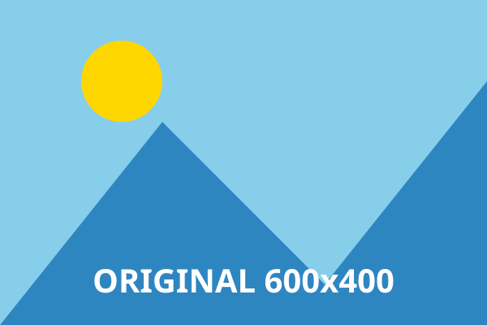
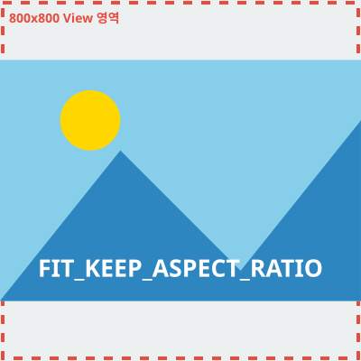
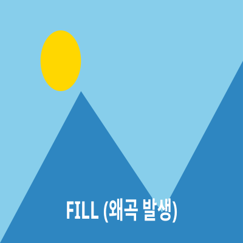
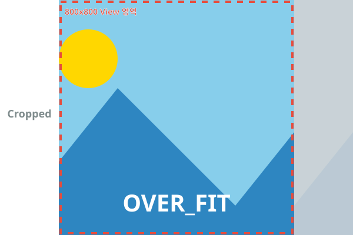
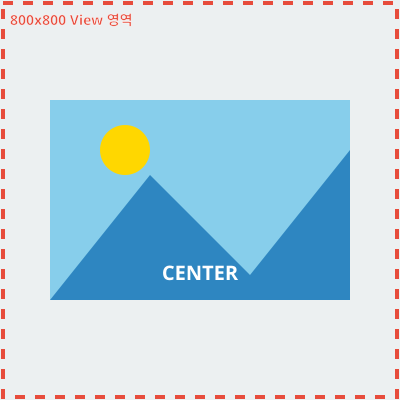

# ImageView FittingMode 직관적 이해 가이드

이미지 크기가 **600x400** 이고, UI View 컴포넌트의 크기가 **800x800** (View가 이미지보다 훨씬 큰) 상황을 가정했습니다.

### 🖼️ [ 원본 소스 이미지 : 600x400 해상도 ]

---

### 1. FIT_KEEP_ASPECT_RATIO
- **비율 유지:** O
- **잘림(Crop):** X  
- **현상:** 이미지 전체가 다 보이도록 영역 내부(800x800)에 맞춰 확대됩니다. 위아래로 레터박스(빈 공간)가 발생합니다.

---

### 2. FILL
- **비율 유지:** X
- **잘림(Crop):** X
- **현상:** 비율을 포기하고 빈 공간이 없도록 가로/세로를 100% 억지로 늘려서 채웁니다. **이미지가 왜곡(찌그러짐)됩니다.**

---

### 3. OVER_FIT_KEEP_ASPECT_RATIO
- **비율 유지:** O
- **잘림(Crop):** O
- **현상:** 비율을 보존한 채로 빈 곳이 없게 꽉 채울 때까지 확대합니다. **크기가 커져서 영역 밖으로 삐져나가는 좌/우 테두리(어두워진 부분)는 화면에서 완전히 잘려나갑니다.**

---

### 4. CENTER
- **비율 유지:** O (크기 완전 고정)
- **잘림(Crop):** X (View 영역이 이미지보다 크기 때문)
- **현상:** 이미지의 원본 해상도(600x400) **그대로 화면의 정중앙에 올려둡니다.** View가 훨씬 크기 때문에 사방에 빈 공간이 남으며, 원본 그대로 예쁘게 안착합니다.

