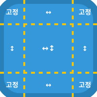
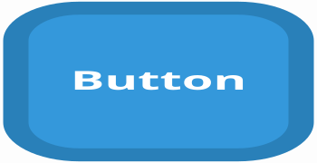
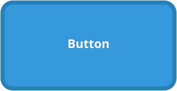

# NPatch (나인패치) 시각화 가이드 🪄

버튼 윤곽선이나 말풍선과 같이 고정된 테두리/모서리가 있는 이미지를 크게 늘릴 때, 이미지가 찌그러지거나 테두리가 뚱뚱해지는 것을 막아주는 마법 같은 분할 렌더링 기술입니다.

---

## 1. NPatch란? (3x3 구역 분할)

이미지를 9개의 구역으로 분할하여 크기가 늘어날 때 늘어날 부분과 고정될 부분을 명확히 나눕니다.

- **고정 영역 (4개의 모서리)**: 크기가 절대 변하지 않습니다. 곡률이나 테두리 두께가 그대로 유지됩니다.
- **↔️ 가로 연장 (상/하 테두리)**: 높이는 유지되고 가로로만 늘어납니다.
- **↕️ 세로 연장 (좌/우 테두리)**: 너비는 유지되고 세로로만 늘어납니다.
- **↔️↕️ 자유 연장 (정중앙)**: 목표 사이즈에 도달할 때까지 가로/세로로 마음껏 늘려서 덩치를 키웁니다.

---

## 2. 일반 확대 vs NPatch 비교

작은 버튼 배경(테두리 두께 8px) 원본을 매우 거대하게 늘렸을 때의 큰 차이를 비교합니다.

### 🖼️ 원본 소스 이미지 (100x100)

 

### ❌ 일반 이미지 모드로 늘렸을 때 (강제 스케일링)
단순히 가로, 세로 스케일을 키워 렌더링하면 **테두리 두께가 비정상적으로 뚱뚱해지고, 둥근 모서리가 타원형으로 일그러지는 심각한 왜곡**이 발생합니다.

 

### ✅ NPatch 모드 (달리의 N-Patch) 적용 시
가장자리(모서리 크기, 8px 테두리 두께)를 고정하면 프로그램이 **무의미한 정중앙 영역만 잡아 늘립니다.** 모서리의 화질과 디자인을 완벽히 보존한 채로 사이즈만 자유롭게 변형되었습니다.

